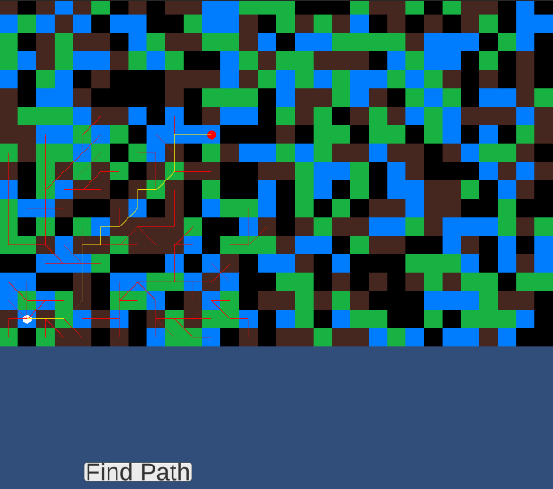

# Pathfinding
A* pathfinding algorithm implementation

# Representation
```
Lines:
Red line represents all steps made during pathfinding
Yellow line represents shortest path found
```

```
Cells:
1. green cell - normal node (normal enter cost)
2. brown cell - difficult node (double enter cost)
3. blue cell - water node (double cost in both enter and exit)
4. black cell - wall node (non walkable)
```

# Screenshots

